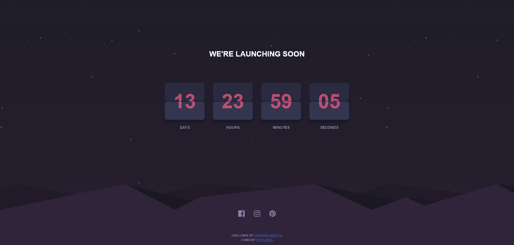

# The project title

## Table of contents

- [Overview](#overview)
  - [The challenge](#the-challenge)
  - [Screenshot](#screenshot)
  - [Links](#links)
- [My process](#my-process)
  - [Built with](#built-with)
  - [What I learned](#what-i-learned)
  - [Continued development](#continued-development)
  - [Useful resources](#useful-resources)
- [Author](#author)
- [Acknowledgments](#acknowledgments)

## Overview

### The project

The challenge is to build out this countdown timer and get it looking as close to the design as possible.

The design: 

### Screenshot

My solution:

### Links

- [Solution URL](https://github.com/mikeFrees/launch-countdown-timer-main)
- [Live Site URL](https://mikes-launch-countdown.netlify.app/)

## My process

### Built with

- Semantic HTML5 markup
- CSS custom properties
- Flexbox
- CSS Grid
- Mobile-first workflow
- [React](https://reactjs.org/) - JS library
- [Next.js](https://nextjs.org/) - React framework
- [Styled Components](https://styled-components.com/) - For styles

### What I learned

Use this section to recap over some of your major learnings

### Continued development

Use this section to outline areas that you want to continue focusing on in future projects. These could be concepts you're still not completely comfortable with or techniques you found useful that you want to refine and perfect.

### Useful resources

- [Boilerplate css file](https://blog.logrocket.com/what-should-modern-css-boilerplate-look-like) - This helped me build the starting points of my _base.scss file.
- [Example resource 2](https://www.example.com) - This is an amazing article which helped me finally understand XYZ. I'd recommend it to anyone still learning this concept.

## Author

- LinkedIn - [Frees Mike](https://www.linkedin.com/in/mike-frees/)
- Frontend Mentor Profile - [Mike Frees](https://www.frontendmentor.io/profile/mikeFrees)

## Acknowledgments

This is where you can give a hat tip to anyone who helped you out on this project. Perhaps you worked in a team or got some inspiration from someone else's solution. This is the perfect place to give them some credit.
